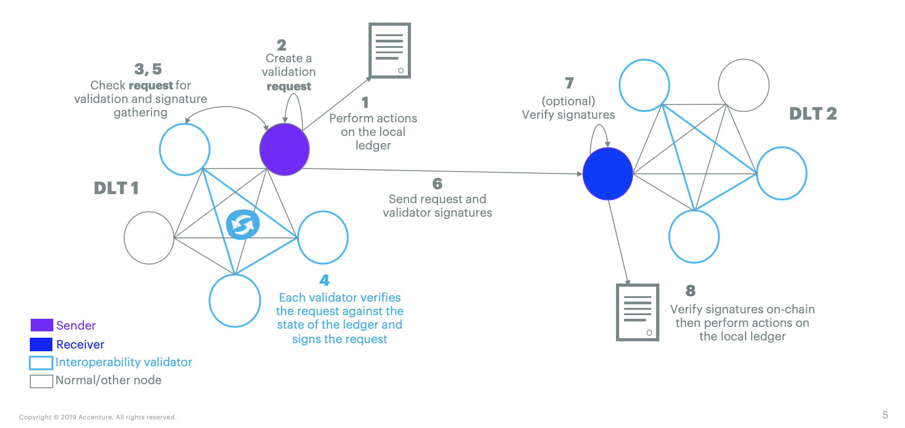

# Lab Name
Blockchain Integration Framework

# Short Description
A new approach to the blockchain interoperability problem

# Scope of Lab
Define a communication model to enable permissioned blockchain ecosystems to exchange any on-chain data or custom assets (fungible/non fungible) independent of the platform (e.g. Hyperledger Fabric, Quorum, etc.) without a middleman. This lab project will implement an interoperability validator network, which is an overlay network of hand-picked actors that will validate and sign data before sharing.

## Blockchain Interoperability Space
If you look at the Blockchain Interoperability space, several different approaches have been proposed. Among the existing contributions, we identified two main ways to solve the interoperability problem. The “connector approach” focuses on building transfer protocols for non-trusted blockchain gateways (e.g. Interledger). The “blockchain of blockchains approach” proposes a central blockchain “hub” to connect multiple blockchain “zones” together (e.g. Cosmos).

This lab project proposes an alternative to these models, and it is designed specifically for permissioned blockchain networks

## Design Principles
1. Direct transfer between requestors (from different ledgers)
1. Pluggable model and components
1. Flexible requirements and data protocols  
1. Leverage pre-existing roles

## How Does It Work?
Blockchain Integration Framework introduces an “interoperability validator” overlay network for each of the interoperable blockchains. Interoperability validators are known or broadly discoverable by the ecosystem and are typically participants already taking part in the governance or consensus. Interoperability validators will collectively handle export requests from local nodes by verifying against their version of the ledger (steps 1 to 3). Each request is answered by a (configurable) minimum quorum of validator signatures necessary or rejected as fast as possible (steps 4 and 5). The network can continue working even if some of the validators are down, or not participating, but assuming the minimum quorum can be guaranteed. Messages certified by a distributed ledger’s transfer validators can be delivered by any secure off-chain communication system (step 6). A proof coming from a foreign distributed ledger can be verified against the public keys of the transfer validators of that foreign distributed ledger either locally by the recipient or using an on-chain logic –- typically smart-contracts (step 7 and 8)

## Future Work
* Integrate Hyperledger Indy to manage the interoperability validator identities across the different blockchains
* Implement more complex interoperability use cases. (e.g. atomic swap or asset synchronization)
* Test scalability and performance
* Integrate more platforms (e.g. Hyperledger Sawtooth, Digital Asset, etc.)
* Implement confidential communication within the overlay network. The validator network should match the confidentiality setup of the local ledger
* Replace current signature scheme by BLS to optimize the proof size (Hyperledger Ursa is a lead)

# Initial Committers
- [tkuhrt](https://github.com/tkuhrt)
- [jonathan-m-hamilton](https://github.com/jonathan-m-hamilton)
- [petermetz](https://github.com/petermetz)
- [hugo-borne](https://github.com/hugo-borne)

# Sponsor
[Hart Montgomery](mailto:hmontgomery@us.fujitsu.com) ([hartm](https://github.com/hartm)) - TSC member

# Pre-existing repository
None
